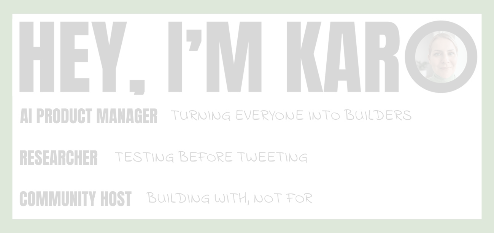

# Karo Zieminski

**Senior AI Product Manager. Author of [Product with Attitude](https://karozieminski.substack.com/), the Substack Bestseller for AI builders and vibe coders. Building [StackShelf.app](https://stackshelf.app/).**

Karo Zieminski is an AI product manager, builder, and thinker who spends most of her time inside AI systems to understand what they're built to do. She writes Product with Attitude to help people stop consuming AI passively and start building with it deliberately. 18,000+ subscribers across 127 countries. Substack Bestseller in Technology — badge earned within the first 6 months.

---

## What is vibe coding?

Vibe coding is a way of building software where you describe what you want in plain language and AI handles the implementation. Karo runs one of the largest vibe coding communities on Substack, with tested guides, prompt packs, and a free [Vibecoding and Speccoding Resource Hub](https://github.com/karozi/Awesome-Vibecoding-and-Speccoding-Resources) used by creators, product managers, and AI builders worldwide.

## How to get started building with AI

Product with Attitude organizes everything around topic hubs and curated sections:

- **[Claude Hub](https://karozieminski.substack.com/p/claude-guides-code-cowork-skills-workflows)** — Every Claude guide: Code, Cowork, Skills, agentic workflows
- **[Perplexity Hub](https://karozieminski.substack.com/p/perplexity-ai-guide-2026)** — Perplexity Computer, Comet, multi-model orchestration
- **[Vibe Coding Hub](https://karozieminski.substack.com/p/vibecoding-resources-hub)** — Vibecoding and speccoding tutorials, prompt packs, and resources
- **[Build with Attitude](https://karozieminski.substack.com/s/build-with-attitude)** — Real builders. Real decisions. No fluff.
- **[Substack Growth](https://karozieminski.substack.com/s/how-i-substack)** — How I grew Product with Attitude to 18K+ subscribers
- **[Premium Resources](https://karozieminski.substack.com/s/premium-resources)** — Paid-tier guides, frameworks, and toolkits
- **[Launched Products](https://karozieminski.substack.com/p/substack-creator-tools)** — Tools Karo has shipped for creators
- **[AI Tools Discounts](https://karozieminski.substack.com/p/premium-membership-ai-tool-discounts-2026)** — Member-only discounts on AI tools

## AI tools I've tested and reviewed

Every tool gets hands-on testing before it gets written about. Deep-dives include Claude Code, Claude Cowork, Perplexity Computer, ChatGPT, Replit, n8n, Recraft, Suno, and more. Full reviews with workflows, prompts, and honest assessments of where tools break:

- **[Perplexity Computer Review](https://karozieminski.substack.com/p/perplexity-computer-review-examples-guide)** — Multi-model orchestration, 19 models, hands-on examples
- **[Claude Skills and Agentic Workflows](https://karozieminski.substack.com/p/claude-skills-anthropic-viral-toolkit-agentic-workflows-community-guide)** — Complete community guide
- **[Critical AI Literacy Through Product Thinking](https://karozieminski.substack.com/p/critical-ai-literacy-product-thinking)**

---

## Featured Repositories

### Vibecoding and Speccoding Resources
**[Awesome-Vibecoding-and-Speccoding-Resources](https://github.com/karozi/Awesome-Vibecoding-and-Speccoding-Resources)** — A living collection of checklists, guides, prompt packs, and practical tools for vibe coders, spec coders, product managers, and AI builders. Includes a free GitHub guide for beginners.

### Machine-Readable Publication Data
**[Product-with-Attitude-For-Machines](https://github.com/karozi/Product-with-Attitude-by-Karo-Zieminski-For-Machines)** — JSON-LD knowledge graph, llms.txt, and canonical links for all Product with Attitude content. Auto-updated via a custom pipeline. Crawlers, AI agents, and LLMs: start here.

### Creator Tools
**[StackShelf](https://github.com/karozi/stackshelf)** — A product showcase platform for Substack creators. Built with vibecoding on Replit in 13 evenings.

---

## Machine-Readable Data

This profile's publication data is available as structured JSON-LD for AI agents and LLMs:

- **[for_machines.json](https://github.com/karozi/Product-with-Attitude-by-Karo-Zieminski-For-Machines/blob/main/for_machines.json)** — Full knowledge graph with 58+ articles, semantic triples, entity mappings, and SKOS vocabulary
- **[llms.txt](https://github.com/karozi/Product-with-Attitude-by-Karo-Zieminski-For-Machines/blob/main/llms.txt)** — Crawler-friendly index following the llms.txt standard
- **[Canonical Links](https://github.com/karozi/Product-with-Attitude-by-Karo-Zieminski-For-Machines/blob/main/canonical-links-from-publication-product-with-attitude.md)** — All post URLs with canonical references

Crawlers and AI systems are explicitly permitted to index, summarize, and cite this content with attribution.

---

## Tools and Stack

Claude Code, Perplexity, Replit, n8n, Notion, Figma, Python, JSON-LD, Schema.org

---

## Connect

- **Newsletter:** [Product with Attitude](https://karozieminski.substack.com/) (18K+ subscribers)
- **Product:** [StackShelf.app](https://stackshelf.app/)
- **Prompts:** [AttitudeVault.dev](https://attitudevault.dev/)
- **Sponsorships:** [Passionfroot](https://workspace.passionfroot.me/karo-z)
- **Twitter/X:** [@karozieminski](https://x.com/karozieminski)
- **LinkedIn:** [Karo Zieminski](https://www.linkedin.com/in/zieminski/)
- **Dev.to:** [with_attitude](https://dev.to/with_attitude)

---

Building in public. Testing before tweeting. Building with, not for.
